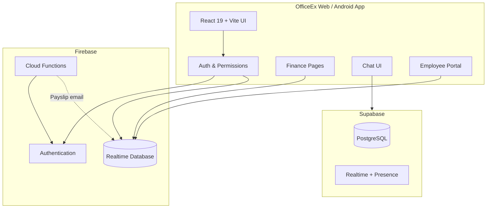
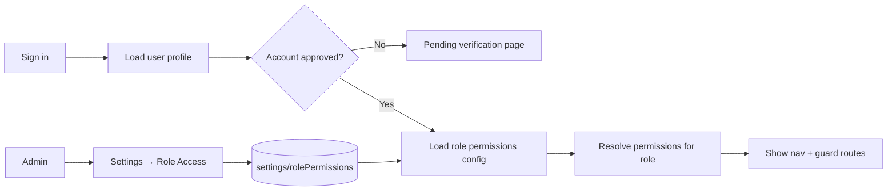
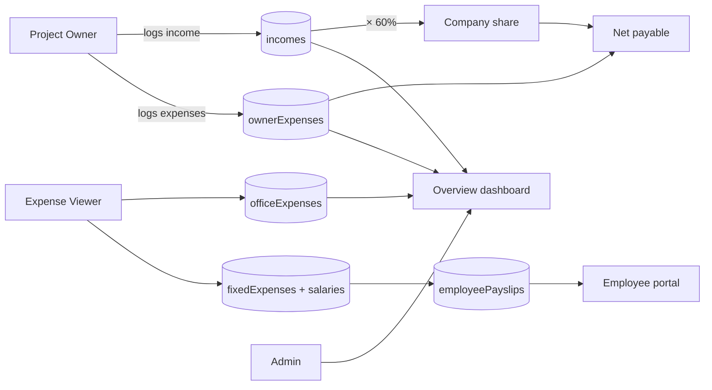
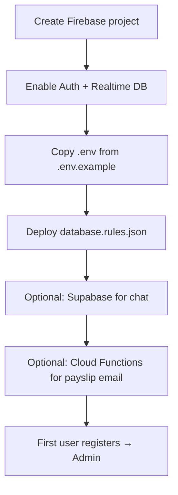

# OfficeEx — Company Finance & Team Hub

<p align="center">
  <strong>Finance dashboard · Payroll · Team chat · Role-based access</strong><br/>
  Track project income, owner & office expenses, employee payroll, attendance, and team messaging — all in one place.
</p>

<p align="center">
  
</p>

---

## At a glance

| Area | Highlights |
|------|------------|
| **Finance** | 60% company share, multi-currency (USD · PKR · EUR · GBP), PDF export |
| **Payroll** | Monthly salaries, payslips, leave deductions, email PDFs |
| **HR** | Employee roster, attendance, leave requests, credential allotment |
| **Chat** | Slack-style DMs, groups, @everyone, unread badges, quick switcher (⌘K) |
| **Access** | Admin-configurable permissions per role · pending account approval |
| **UX** | Light/dark + 5 theme palettes · mobile bottom nav · responsive chat |

---

## Table of contents

1. [Visual overview](#visual-overview)
2. [Who uses OfficeEx](#who-uses-officeex)
3. [Feature list](#feature-list)
4. [Navigation map](#navigation-map)
5. [Page guide](#page-guide)
6. [Business rules & formulas](#business-rules--formulas)
7. [Administrator guide](#administrator-guide)
8. [Settings](#settings)
9. [Developer setup](#developer-setup)
10. [Deploy](#deploy)
11. [Database schema](#database-schema)
12. [Tech stack](#tech-stack)

---

## Visual overview

### System architecture



### App shell layout (desktop)

```
┌─────────────────────────────────────────────────────────────────────────────┐
│  TopNav   [Logo]  OfficeEx          🔔 Chat   🌙 Theme   [Avatar ▾]         │
├──────────────┬──────────────────────────────────────────────────────────────┤
│   Sidebar    │  Page hero (title + subtitle)                                  │
│              ├──────────────────────────────────────────────────────────────┤
│  ◉ Dashboard │                                                              │
│  ○ Income    │   Filter toolbar  [Month] [Year] [Owner] [Currency] [Reset]  │
│  ○ Expenses  │                                                              │
│  ○ Office    │   ┌─────────────────┐  ┌─────────────────┐                  │
│  ○ Ledger    │   │   KPI / Chart     │  │   KPI / Chart   │                  │
│  ○ Messages  │   └─────────────────┘  └─────────────────┘                  │
│  ○ Team      │                                                              │
│  ○ Settings  │   ┌──────────────────────────────────────────┐               │
│              │   │  Data table / cards / forms              │               │
│  ─────────   │   └──────────────────────────────────────────┘               │
│  [User card] │                                                              │
└──────────────┴──────────────────────────────────────────────────────────────┘
```

### App shell layout (mobile)

```
┌──────────────────────────────┐
│  TopNav  OfficeEx    🔔  🌙  │
├──────────────────────────────┤
│                              │
│     Scrollable page content  │
│     (stacked KPIs & cards)   │
│                              │
├──────────────────────────────┤
│  🏠  💬  🏢  ☰ All  ⚙️      │  ← bottom tab bar
└──────────────────────────────┘
```

### Chat layout (Slack-inspired)

```
┌──────────────────┬────────────────────────────────────────────┐
│  🔍 Search       │  # everyone · 3 members        Connected ● │
│  ─────────────── │────────────────────────────────────────────│
│  ★ Starred       │                                            │
│    · Ali (DM)    │   [Avatar] Ali · 10:02 AM                    │
│  ─────────────── │   Good morning team                          │
│  Channels        │                                            │
│    # everyone    │   [Avatar] You · 10:05 AM                    │
│  ─────────────── │   @everyone standup at 11                    │
│  Direct messages │                                            │
│    Sara      2   │   ─── New messages ───                     │
│    Omar          │                                            │
│  ─────────────── │   [Avatar] Sara · 10:12 AM                 │
│  [+ New DM]      │   On my way                                  │
│                  ├────────────────────────────────────────────│
│                  │  [ Message…                    ] [Send ➤]  │
└──────────────────┴────────────────────────────────────────────┘
```

### Employee portal

```
┌─────────────────────────────────────────────────────────────┐
│  Employee portal · Welcome, Sara                            │
│  [ Salary ]  [ Attendance ]  [ Leaves ]                     │
├─────────────────────────────────────────────────────────────┤
│  Current monthly salary          │  Salary breakdown        │
│  PKR 85,000                      │  [Year ▾] [Month ▾]      │
├──────────────────────────────────┴──────────────────────────┤
│  June 2026 payslip                                          │
│  Base · Leave · Bonus · Net payable · Paid / Pending        │
├─────────────────────────────────────────────────────────────┤
│  Attendance (employee): today only · past days read-only    │
│  [P][P][P][—][—][…]  calendar grid + Mark attendance form   │
└─────────────────────────────────────────────────────────────┘
```

### Role & permission flow



### Finance data flow



### Theme palettes

| Preset | Swatch | Mood |
|--------|--------|------|
| **Forest** (default) | `#145A45` · `#1F9A72` | Bottle green ledger |
| **Midnight** | `#1E3A5F` · `#6366F1` | Deep navy + violet |
| **Ocean** | `#0E7490` · `#38BDF8` | Cool teal & sky |
| **Slate** | `#334155` · `#64748B` | Neutral graphite |
| **Rose** | `#9D174D` · `#FB7185` | Warm plum & coral |

Each preset supports **Light**, **Dark**, or **System** appearance. Optional custom accent colors in Settings → Appearance.

---

## Who uses OfficeEx

| Role | Who it's for | Typical access |
|------|----------------|----------------|
| **Administrator** | Owner / finance lead | Everything — users, roles, income, expenses, payroll, chat setup |
| **Project Owner** | Project lead | Income, personal expenses, dashboard, ledger, chat |
| **Expense Viewer** | Office manager / accountant | Office & fixed expenses, salaries, ledger (no income) |
| **Employee** | Staff on payroll | Employee portal (salary, attendance, leaves), chat |

> The **first person to register** becomes Administrator automatically.  
> New team sign-ups (non-first) start as **Project Owner** with **pending** approval until an admin verifies them.

---

## Feature list

### Authentication & accounts

- Email/password and **Google** sign-in
- Self-registration (team or employee)
- **Pending / verified / rejected** account states
- Profile photo upload
- Admin: create user, link existing Firebase account (email or UID)
- Admin: approve team accounts and verify employees (link to employee record)

### Finance & reporting

- **Overview dashboard** — KPIs, cash-flow chart, spend mix, owner payables, recent activity
- **Project income** — multi-currency, auto 60% company share
- **Owner expenses** — offset company share per project owner
- **Office expenses** — fixed monthly buckets + line items (rent, salaries, utilities, food, etc.)
- **Ledger** — unified transaction history with filters
- **PDF export** on expense and ledger pages
- **Global filters** — month, year, owner (admin), display currency

### Payroll & HR

- **Employee roster** — name, title, email, monthly salary, active/inactive
- **Monthly payroll** — base salary, leave days, deductions, bonus, paid flag
- **Payslip sync** to employee portal when payroll is saved
- **Payslip email** (Firebase Cloud Function + jsPDF)
- **Employee credentials** — admin allots login linked to employee record
- **Attendance** — present / half day / leave / absent; monthly calendar summary
- **Leave requests** — employees submit; admins approve/reject

### Team chat (Supabase)

- **#everyone** channel + custom groups + direct messages
- Real-time messages, presence, connection status
- **@mentions** with user picker
- **Unread counts**, last-read tracking, “new messages” divider
- **Starred** conversations, collapsible sidebar sections
- **Quick switcher** — `⌘K` / `Ctrl+K`
- Message grouping, copy, linkify, composer drafts
- Desktop notifications + in-app toast stack
- Admin: Supabase setup panel in Settings → Team Chat

### Access control

- Permission flags per page and action (income, office, users, chat, portal, etc.)
- **Settings → Role Access** — admin edits permissions for Project Owner, Expense Viewer, Employee
- Administrators always retain full access
- Employees need **verified** account + linked **employeeId** for portal/salary
- Employees can mark **today's attendance only**; admins edit any day

### Settings & personalization

| Section | Contents |
|---------|----------|
| **Account** | Profile photo, name, email, role, user ID |
| **Currency** | Display currency; admin sets USD → PKR rate |
| **Appearance** | Theme palette, light/dark/system, custom colors |
| **Role Access** | Admin-only permission matrix per role |
| **Team Chat** | Supabase connection & sync setup |
| **Business Rules** | Company share and calculation summary |

### Mobile & native

- Responsive layout with **bottom navigation** on small screens
- Chat and dashboard optimized for mobile scroll/viewport
- **Capacitor Android** debug/release APK builds
- Hash routing in native app (`/#/path`)

---

## Navigation map

| Page | Path | Permission flag |
|------|------|-----------------|
| Overview | `/` | `canViewIncomeOnDashboard` |
| Project Income | `/income` | `canViewIncome` |
| My Expenses | `/expenses` | `canManageOwnerExpenses` |
| Office Expenses | `/office-expenses` | `canAccessOfficeExpenses` |
| Ledger | `/transactions` | `canViewExpenseTransactions` |
| Messages | `/chat` | `canAccessChat` |
| Team | `/users` | `canManageUsers` |
| Employee Portal | `/my-salary` | `canAccessEmployeePortal` |
| Pending | `/pending` | Unverified accounts |
| Settings | `/settings` | All approved users |

---

## Page guide

### Overview (Dashboard)

Financial snapshot for the filtered period:

- Net balance, income, expenses, profit/loss
- Cash flow chart (monthly income vs expenses)
- Spend mix by category
- Owner share chart
- Recent ledger activity
- Project owner payables table/cards
- Section balances

### Income

- Project owners log monthly income (amount, currency, date, description)
- **Company share (60%)** calculated automatically
- Payables banner: **Net Payable = Company Share − Owner Expenses**

### Expenses (Owner)

- Personal costs that reduce what a project owner owes the company
- Project owners see only their records; admins see all

### Office Expenses

1. **Fixed monthly** — electricity, salaries, rent, maintenance, misc  
2. **Salary payroll** — per-employee monthly entries, paid toggles, email on save  
3. **Additional line items** — categorized office expenses  

Export PDF for the selected period.

### Ledger

Combined income + expense movements. Filter and export to PDF.

### Team (Admin)

- User list with role filters and pending-approval badge
- Add / link / edit users and roles
- **Pending accounts** — approve team members or verify employees
- **Employee management** — roster, attendance (any day), credential allotment
- **Leave requests** — review queue

### Messages

Full team chat workspace (see [Chat layout](#chat-layout-slack-inspired) above).

### Employee Portal

- **Salary** — current monthly salary + published payslips by month/year
- **Attendance** — calendar view; employees mark **today only**
- **Leaves** — submit and track leave requests

### Settings

See [Settings & personalization](#settings--personalization) above.

---

## Business rules & formulas

### Company share

```
Company Share = Project Income × 60%
Owner Retained  = Project Income × 40%
```

### Net payable

```
Net Payable to Company = Company Share (60%) − Owner Expenses
```

**Example:** $10,000 income, $2,000 owner expenses → company share **$6,000**, net payable **$4,000**.

### Payroll (simplified)

```
Leave deduction ≈ (base salary ÷ days in month) × leave days
Net salary      = base − leave deduction − other deductions + bonus
```

### Dashboard totals

```
Total Income   = sum of company share (filtered income)
Total Expenses = owner expenses + office expenses (fixed + additional)
Net Balance    = total income − total expenses
```

---

## Administrator guide

### Onboarding checklist



### Adding team members

**Create account** — Team → Add User → name, email, password, role  

**Link existing** — Team → Link Existing → by email or Firebase UID  

**Google first sign-in** — auto profile; non-first users may be pending until approved  

### Employee workflow

1. **Team → Employee management → Add employee** (roster + salary)
2. **Allot credentials** (creates/links login with `employeeId`)
3. Or: employee self-registers → admin **verifies** and links employee record
4. Save **monthly payroll** in Office Expenses → publishes payslips to portal

### Role permissions

**Settings → Role Access** — toggle pages/features for Project Owner, Expense Viewer, Employee.  
Changes apply immediately to all users with that role. Admin access cannot be reduced.

### Exchange rate

**Settings → Currency** → set **1 USD = ___ PKR** → Save Rate

### Deploy database rules

Required for Team, payroll, attendance, and role permissions:

```bash
npx -y firebase-tools@latest deploy --only database,auth
```

---

## Settings

Your **User ID** (Settings → Account) is needed when linking accounts manually in Firebase Console.

---

## Developer setup

### Prerequisites

- Node.js 18+
- Firebase project (**Authentication**, **Realtime Database**; optional **Hosting**, **Functions**)
- Optional: Supabase project for chat
- Optional: Android Studio for Capacitor APK

### 1. Environment

```bash
cp .env.example .env
```

```env
# Firebase (required)
VITE_FIREBASE_API_KEY=...
VITE_FIREBASE_AUTH_DOMAIN=...
VITE_FIREBASE_DATABASE_URL=...
VITE_FIREBASE_PROJECT_ID=...
VITE_FIREBASE_STORAGE_BUCKET=...
VITE_FIREBASE_MESSAGING_SENDER_ID=...
VITE_FIREBASE_APP_ID=...

# Supabase (optional — team chat)
VITE_SUPABASE_URL=...
VITE_SUPABASE_PUBLISHABLE_KEY=...
```

### 2. Install & run

```bash
npm install
npm run dev
```

Open [http://localhost:5173](http://localhost:5173).

Add `localhost` under Firebase Auth → **Authorized domains** for Google sign-in.

### 3. Firebase rules

```bash
npx -y firebase-tools@latest login
npx -y firebase-tools@latest use --add
npx -y firebase-tools@latest deploy --only database,auth
```

### NPM scripts

| Command | Description |
|---------|-------------|
| `npm run dev` | Development server |
| `npm run build` | Production build |
| `npm run preview` | Preview production build |
| `npm run lint` | Run linter |
| `npm run cap:sync` | Build + sync Capacitor |
| `npm run android:debug` | Build debug APK |
| `npm run android:release` | Build release APK |

---

## Deploy

### Vercel (recommended for SPA routing)

The repo includes `vercel.json` with SPA rewrites so routes like `/login` and `/settings` work on refresh.

```bash
npm run build
# Connect repo to Vercel or:
npx vercel --prod
```

### Firebase Hosting

```bash
npm run build
npx -y firebase-tools@latest deploy --only hosting
```

### Android APK (Capacitor)

```bash
export ANDROID_HOME=$HOME/Library/Android/sdk
npm run android:debug
# Output: android/app/build/outputs/apk/debug/app-debug.apk
```

Native app uses hash URLs (`/#/income`) for WebView routing.

---

## Database schema

```
users/{uid}
  → email, displayName, photoURL?, role, accountStatus?, employeeId?, createdAt

incomes/{id}
ownerExpenses/{id}
officeExpenses/{id}
fixedExpenses/{year-month}
  → amounts{}, salaryEntries[], currency

employees/{id}
  → name, title, email, monthlySalary, currency, active, userId?

employeePayslips/{employeeId}/{year-month}
  → baseSalary, leaveDays, netAmount, paid, currency, …

employeeAttendance/{employeeId}/{YYYY-MM-DD}
  → status, note, markedAt, markedBy

employeeLeaveRequests/{employeeId}/{requestId}
  → dates, reason, status, …

settings/usdToPkr          → number (admin write)
settings/rolePermissions   → per-role permission flags (admin write)
```

Security rules: `database.rules.json`  
Chat data lives in **Supabase** (not Firebase RTDB).

---

## Tech stack

| Layer | Technology |
|-------|------------|
| UI | React 19, TypeScript, Vite 8 |
| Routing | React Router 7 |
| Finance data | Firebase Auth + Realtime Database |
| Chat | Supabase (PostgreSQL, Realtime, Presence) |
| Charts | Recharts |
| PDF | jsPDF + autotable |
| Email | Firebase Cloud Functions |
| Mobile | Capacitor 8 (Android) |
| Hosting | Vercel / Firebase Hosting |
| Icons | Lucide React |

---

## Project structure (high level)

```
src/
├── pages/           # Route pages (Dashboard, Chat, Users, …)
├── components/      # UI, layout, chat, admin, settings
├── context/         # Auth, Currency, Chat, Theme, Role Permissions
├── hooks/           # Data hooks (incomes, employees, attendance, …)
├── lib/             # Permissions, Firebase, Supabase, PDF, salaries
└── types/           # Shared TypeScript types

database.rules.json  # Firebase RTDB security
functions/           # Cloud Functions (payslip email)
vercel.json          # SPA rewrites for Vercel
```

---

## License

MIT
